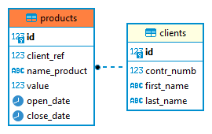

## Добрый день, Дмитрий.

### C pl начинаю знакомиться, пока ничего серьезного написать не могу. Поэтому сделал по старинке: CRUD операции с БД PostgreSQL из Python.
### Интересующая Вас функция находится в файле functions.py. На вход функция принимает СНИЛС, если проверка контрольного числа пройдена успешно, функция вернет контрольное число. Если нет, то функция вернет строку с описанием проблемы. В этом же файле есть функции вставки данных в БД, обновления данных и выборки.
### Запуск функций осуществляется из файла main.py, где задаются исходные данные для пользователя. Затем осуществляется проверка контрольного числа СНИЛС пользователя и, если проверка выполняется, запускаются функции вставки, обновления, выборки. 
### Функция, создающая структуру БД, находится в файле create_tables.py.
### Функцию проверки контрольного числа тестировал с помощью значений СНИЛС с сайта генератора СНИЛС - https://ortex.github.io/snils-generator/. Протестировал где-то 40 значений. Вроде отрабатывает хорошо.

### P.S. Конечно, в этом решении много недочетов: плохо спроектировал структуру БД, не сделал требования уникальности в таблице clients, хранить контрольное число в БД тоже неверно (надо хранить хэш),  добавить поля в index для ускорения поиска ну и другое. Времени маловато получилось. 

### Структура базы данных
